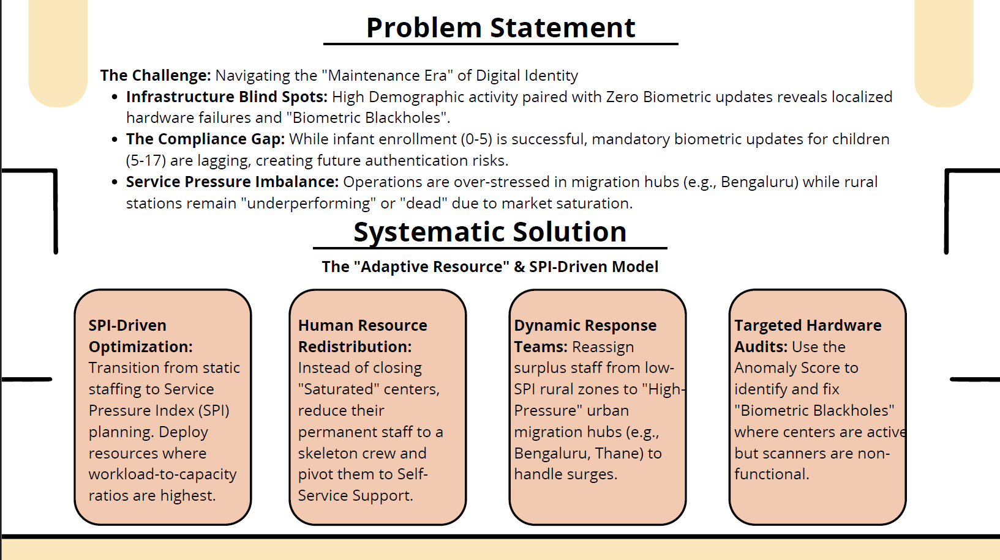
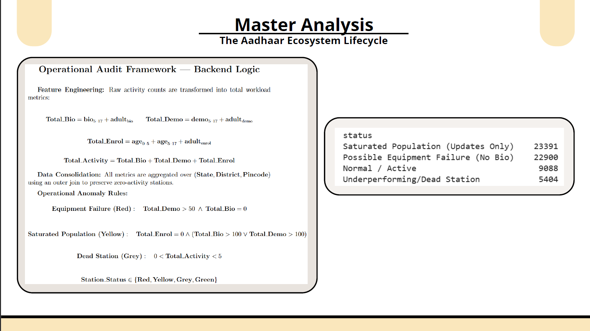

## 📌 Problem Context

## ⚙️ System Design & Analysis

## 📈 Key Outcomes

# UIDAI Data Optimization – Operational Efficiency

> Designed a data-driven system to optimize Aadhaar service delivery by dynamically reallocating resources based on regional demand patterns.

---

## 🚨 Problem
Aadhaar service centers face inefficiencies due to uneven workload distribution, infrastructure blind spots, and gaps in biometric update compliance.

---

## 🔍 Key Insights
- High demographic updates but low biometric updates in certain regions  
- Urban centers face overload while rural centers remain underutilized  
- Presence of “biometric blackholes” due to hardware failures  
- Aadhaar ecosystem has transitioned to a maintenance-driven lifecycle  

---

## 💡 Solution
Developed a **Service Pressure Index (SPI)-based model** to:
- Dynamically redistribute human resources  
- Identify high-pressure service regions  
- Detect infrastructure failures  
- Improve biometric compliance  

---

## ⚙️ Approach
- Processed and cleaned **4.5M+ records**  
- Removed ~590K duplicate entries  
- Standardized administrative inconsistencies  
- Built anomaly detection logic for system failures  
- Designed SPI-based dynamic allocation framework  

---

## 📈 Impact
- Targeted ~30% reduction in service wait times  
- Improved biometric update compliance  
- Reduced infrastructure inefficiencies  
- Enabled data-driven decision making at scale  

---

## 🧠 Product / System Thinking
Shifted from **static resource allocation → adaptive, data-driven system design**.

Key trade-off:
- Balanced efficiency improvements with rural accessibility  
- Avoided aggressive consolidation to maintain service coverage  

---

## 📎 Case Study
[View Full Deck](./uidai-case-study.pdf)
